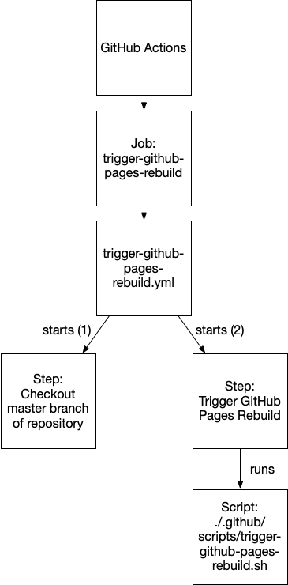
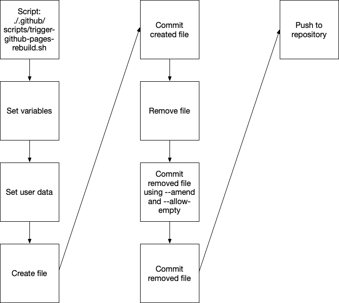

---
---

# Workflow docs
This document shares information on any workflows running in this site.

To check the status of any workflows, go to [https://www.cambermast.com/workflow-status](https://www.cambermast.com/workflow-status)

# trigger-gitbub-pages-rebuild (Jekyll)
If a manual change is made to any item in a GitHub Pages (Jekyll) site, GitHub automatically runs an environment deployment called github-pages.

Since Jekyll is a static site, it will not re-build automatically to, say, allow you to access the current date. The reason for that is the "current date" is actually == "current date of the last build".

The workflow is contained within the `.github/workflows` folder and performs the following actions.

The workflow runs a script contained with the `.gitgub/scripts` folder and performs the following actions:

NOTE: The file the script creates is only temporary and is designed solely to trigger the github-pages environment deployment.

## Installing the GitHub Action (workflow)
Go to the root of your repo and to the main line (main, master, prod, etc.).
1. Create a .github/scripts folder and copy trigger-github-pages-rebuild.sh into that folder.
2. Create a .github/workflows folder and copy trigger-github-pages-rebuild.yml into that folder.
3. On your local machine, go to the .github/scripts folder and type `chmod +x trigger-github-pages-rebuild.sh`. See note below.
4. Commit changes and push to GitHub. 

Note: the chmod provided was for MacOS/ZSH. If the workflow does not run because of a permissions issue, try:
`git add --chmod=+x trigger-github-pages-rebuild.sh`

You can modify the .yml file's CRON job to run as you like. You can also trigger the workflow manually on GitHub by going to your repo->actions->Trigger GitHub Pages Rebuild->Run Workflow->Run Workflow.

